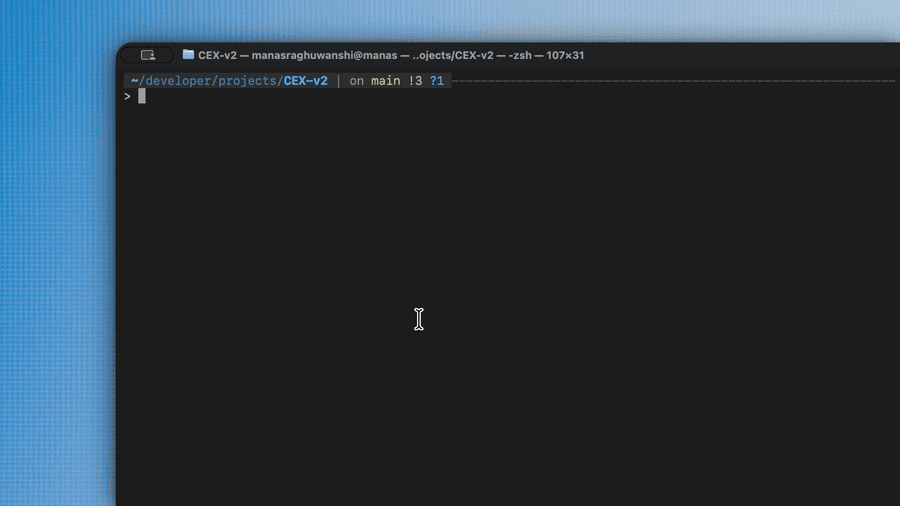

# Woopcode

[](https://bun.sh)
[](https://www.typescriptlang.org)
[](LICENSE)

**A terminal-native coding agent that understands your repository, shows its work, and keeps you in control of code changes.**

Woopcode runs where you work: in the terminal and inside the current repository. Ask it to investigate, explain, implement, review, or test a change; it streams progress, uses focused tools, and presents edits as a readable diff before it writes to an existing file.

> **Status:** an early-stage project with a production-ready Google Gemini workflow. Other provider entries may appear in configuration, but Google Gemini is the only runtime provider currently implemented.

## Demo



## Why Woopcode

|                             |                                                                                                                                                                                                                                         |
| --------------------------- | --------------------------------------------------------------------------------------------------------------------------------------------------------------------------------------------------------------------------------------- |
| **Repository-aware**        | Starts with your package metadata, README, and top-level project structure, then discovers deeper context only when needed. Repository context is budgeted per request rather than dumped, since the agent can read any file on demand. |
| **Terminal-first**          | A focused React Ink interface with a pinned header, scrollable conversation, keyboard navigation, and no browser tab required.                                                                                                          |
| **Visible execution**       | Streams assistant output and tool activity so you can follow the work instead of waiting behind an opaque progress screen.                                                                                                              |
| **Review before overwrite** | Existing-file edits and overwrites pause on a unified diff for approval.                                                                                                                                                                |
| **Practical guardrails**    | Detects duplicate tool calls, limits tool iterations, supports cancellation, and returns recoverable tool errors to the agent.                                                                                                          |

## Quick start

### 1. Install or run

Woopcode requires [Bun](https://bun.sh) 1.0 or later.

```bash
# Run without installing
bunx woopcode

# Or install globally
bun add -g woopcode
```

### 2. Start it in a repository

```bash
cd path/to/your-project
woopcode
```

On first launch, Woopcode opens the setup flow and asks for a Google Gemini API key. You can also configure it from the command line:

```bash
woopcode providers login --provider google --api-key "$GOOGLE_API_KEY"
woopcode providers list
```

Get a Google Gemini key from [Google AI Studio](https://aistudio.google.com/apikey).

### 3. Give it a task

```text
Explain how authentication is structured in this repository.
Find the failing test and fix the underlying bug.
Add validation to the create-user endpoint and cover it with tests.
Review the recent changes for race conditions.
```

## The workflow

```text
Prompt → repository context → streaming agent → focused tools → review diff → verified result
```

1. Woopcode loads lightweight context from the current repository.
2. The agent inspects only the files and symbols needed for the request.
3. It calls tools to search, read, edit, test, or fetch documentation.
4. Changes to an existing file are shown as a unified diff.
5. Press **Enter** to apply the diff or **Esc** to reject it.

The conversation, provider configuration, and local state are stored in:

- macOS and Linux: `~/.config/woopcode/`
- Windows: `%LOCALAPPDATA%\\woopcode\\`

### Session history

Conversation history is written after every turn using an atomic write, so an interrupted session does not leave a half-written transcript behind. Restarting Woopcode in the same repository resumes from that history; `/new` clears it.

Only user and assistant messages are persisted, capped at the most recent messages. Tool calls and their results are dropped: they are the bulk of a long transcript, they only mean something to the turn that produced them, and persisting half of a call/result pair would make the restored history invalid for the provider.

## Built-in tools

Woopcode currently ships with 13 tools.

| Area        | Tools                                      | Purpose                                                                                               |
| ----------- | ------------------------------------------ | ----------------------------------------------------------------------------------------------------- |
| Explore     | `find_files`, `glob`, `list_files`, `grep` | Locate files, patterns, directories, and text.                                                        |
| Read        | `read_file`, `web_fetch`, `web_search`     | Read local files or retrieve relevant external documentation.                                         |
| Change      | `edit_file`, `write_file`, `create_file`   | Make targeted replacements, overwrite an existing file, or create a new one (an empty file is valid). |
| Verify      | `run_tests`, `run_terminal`                | Run focused test, build, lint, or inspection commands.                                                |
| Collaborate | `ask_user`                                 | Ask for clarification when a decision requires your input.                                            |

### Change safety

- `edit_file`, `write_file`, and `create_file` show a diff and wait for approval before changing the workspace.
- `run_terminal` and `run_tests` show the exact command and wait for approval before execution. They are intended for short, non-interactive commands and do not start servers or watch processes.
- Tool failures and repeated calls are returned to the agent so it can adjust rather than silently retrying the same action.

## In-app commands and controls

Type `/` in the prompt to browse and autocomplete commands.

| Command                       | Description                                                              |
| ----------------------------- | ------------------------------------------------------------------------ |
| `/help`                       | Show all available commands.                                             |
| `/new`                        | Start a new conversation.                                                |
| `/provider [name]`            | View or switch the configured provider.                                  |
| `/login <provider> <api-key>` | Authenticate from inside the app.                                        |
| `/logout [provider]`          | Remove a saved provider key.                                             |
| `/models`                     | Show the active model and the models available for the current provider. |
| `/workspace`                  | Show repository, path, branch, and file count.                           |
| `/status`                     | Show workspace, provider, session, and version details.                  |
| `/version`                    | Show the Woopcode version.                                               |
| `/exit`                       | Quit Woopcode.                                                           |

Most commands have short aliases: `/h` or `/?` for help, `/clear` or `/reset` for `/new`, `/p` for provider, `/m` or `/model` for models, `/v` for version, `/q` or `/quit` for exit.

| Key                     | Action                                                |
| ----------------------- | ----------------------------------------------------- |
| `↑` / `↓`               | Scroll the conversation.                              |
| `Page Up` / `Page Down` | Move through the conversation by a page.              |
| `Home` / `End`          | Jump to the oldest message or back to the latest one. |
| `Ctrl+C`                | Cancel an active request, or exit when idle.          |
| `Enter` / `Esc`         | Apply or reject a pending file-change preview.        |

## Command line

```bash
# Launch the interactive agent
woopcode
woopcode agent

# Inspect configured providers and models
woopcode providers list
woopcode models
```

Run `woopcode --help`, `woopcode providers --help`, or `woopcode models --help` for the full command reference.

## Development

```bash
git clone https://github.com/mangit955/woop-code.git
cd woop-code

bun install
bun run start

# Run the full test suite
bun test
```

The project is TypeScript throughout and uses:

- [Bun](https://bun.sh) for the runtime, package management, filesystem APIs, and test runner
- [React](https://react.dev) and [Ink](https://github.com/vadimdemedes/ink) for the terminal UI
- [Google Gen AI](https://ai.google.dev) for the current streaming provider integration

Useful implementation entry points:

| Path                                                   | Responsibility                                                          |
| ------------------------------------------------------ | ----------------------------------------------------------------------- |
| [`cli.ts`](cli.ts)                                     | Command-line entry point.                                               |
| [`commands/agent.tsx`](commands/agent.tsx)             | Interactive agent lifecycle and terminal input.                         |
| [`config/runtime.ts`](config/runtime.ts)               | Streaming agent loop, tool execution, recovery, and limits.             |
| [`tools/index.ts`](tools/index.ts)                     | Built-in tool registry and provider-name compatibility.                 |
| [`tui/src/`](tui/src)                                  | The React Ink interface, timeline, prompt, scrolling, and diff preview. |
| [`commands/slash/README.md`](commands/slash/README.md) | Slash-command implementation notes.                                     |

## Contributing

Issues and pull requests are welcome. Keep changes focused, follow the existing TypeScript style, and include relevant tests.

```bash
bun test
```

Please do not commit API keys, conversation history, or generated local configuration.

## License

[MIT](LICENSE)
